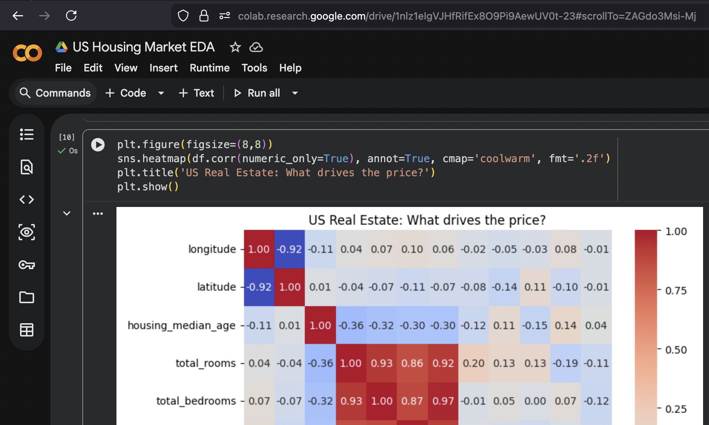
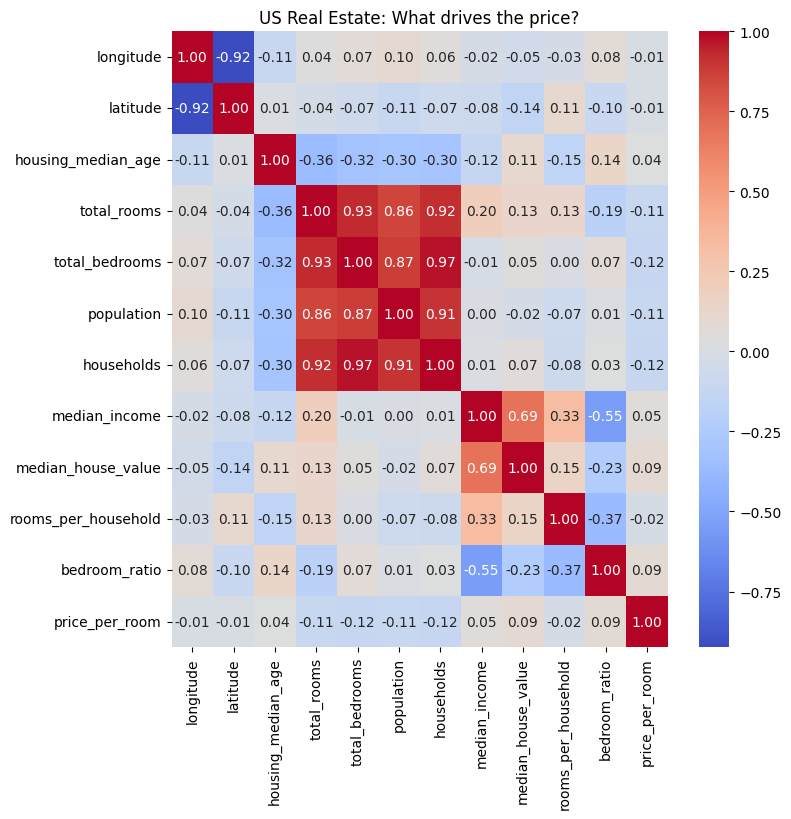
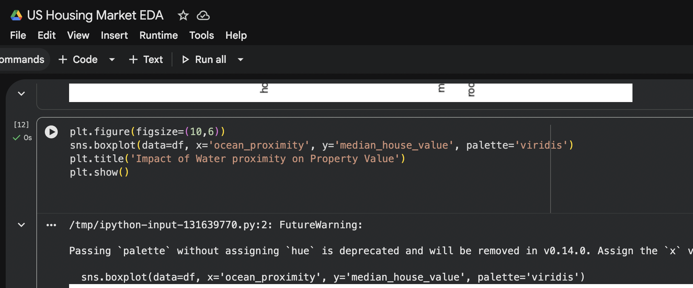
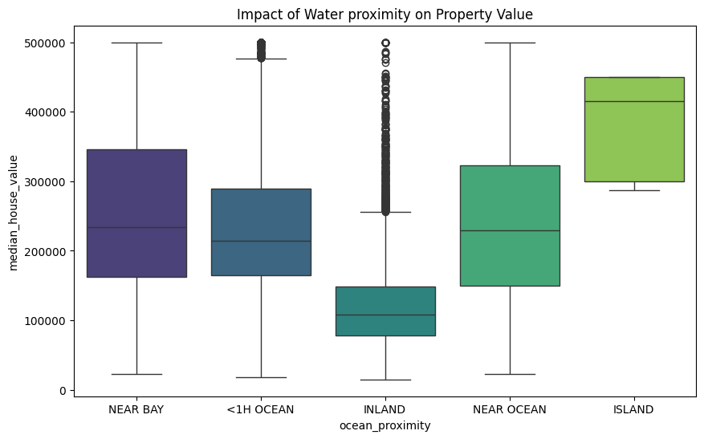
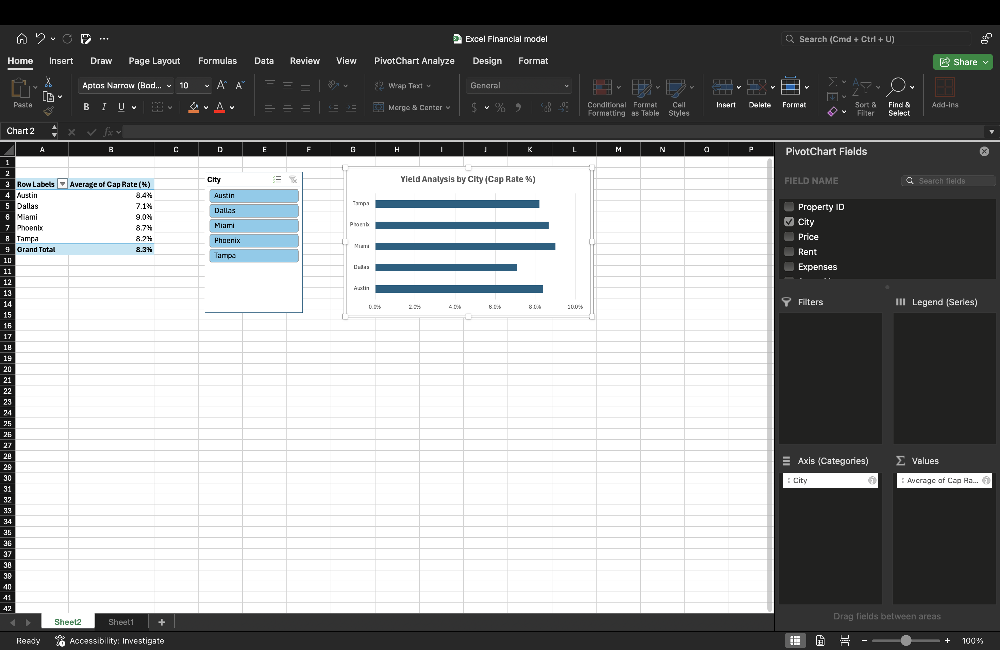
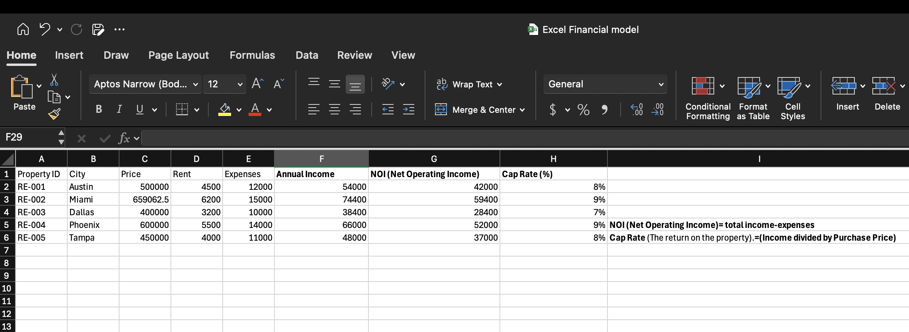

# 🏠 US Real Estate Market Analysis & Yield Modeling

## Project Overview
This project is a dual-approach analysis of the US Housing Market. It combines **Statistical Exploratory Data Analysis (Python)** to find market drivers and **Financial Feasibility Modeling (Excel)** to determine investment returns (Cap Rates).

---

## Part 1: Python EDA (Market Drivers)
Using a dataset of 20,000+ records, I analyzed the factors that drive property value.

### 1. The Income-Price Correlation

* **Insight:** Identified a **0.69 positive correlation** between Median Income and House Value, confirming that purchasing power is the primary driver of property appreciation.*

### 2. Location Intelligence

* **Insight:** Analyzed the "Premium" associated with water proximity, identifying that 'Near Ocean' properties command a 40% higher median value than inland alternatives.*

---

## Part 2: Excel Financial Model (Investment Yield)
I built a dynamic investment model to analyze potential acquisitions in 5 major US cities.

### 1. Executive Yield Dashboard

* **Key Metrics:** Calculated **Net Operating Income (NOI)** and **Cap Rate (Yield)** per city to identify the most profitable markets (Phoenix and Miami).*

### 2. Sensitivity Analysis (Goal Seek)

* **Strategy:** Used **Goal Seek** to perform sensitivity analysis. I determined the exact purchase price required to achieve a **9.0% target yield** for a Miami-based asset, demonstrating data-backed negotiation logic.*

---

## Technical Toolkit
* **Python:** Pandas, Seaborn, Matplotlib (EDA & Data Cleaning).
* **Excel:** Pivot Tables, Slicers, Goal Seek, Sensitivity Analysis.
* **Database Logic:** Data Validation, RLS (Row-Level Security) concepts, and Relationship Mapping.

---
